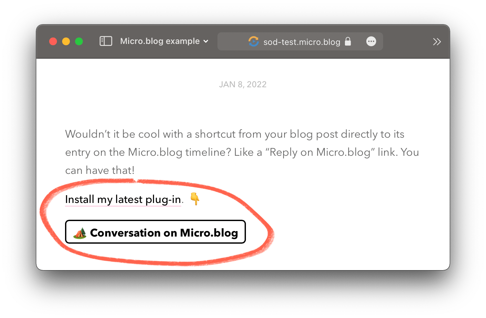

# ✴️ Conversation on Micro.blog

Link to your post on the Micro.blog timeline.

> With this convenient plug-in your blog posts get a **Conversation on Micro.blog** link. When a reader taps that link, they will swiftly end up on the Micro.blog timeline for your blog post.

To get updates on this plug-in, [follow @sod on Micro.blog](https://micro.blog/sod).

## Bells and whistles

* 🛠 Customizable via plug-in settings.
* ✴️ Change the link text to whatever you want. Go bananas! Use emojis!
* ⛳️ Flexible placement in your theme using a Hugo partial.
* 🎁 Customize the look and feel using CSS.

## Get started

Hey, fellow microblogger! 👋

This Micro.blog plug-in is still in beta. But it's a working plug-in that you can manually install and play around with. The installation will be a lot easier in the future. So bear with me for now.

### Install the plug-in

1. Sign in to https://micro.blog in your favorite browser.

2. [Follow this link](https://micro.blog/account/themes/new?plugin=1) or manually go to *Design* → *Edit Custom Themes* and press *New Plug-in*.

3. Enter a fitting *Title* (like Conversation on Micro.blog).

4. Enter `https://github.com/svendahlstrand/plugin-conversation-on-mb` inside *Clone URL*.

5. Choose which *Site* you want to install the plug-in.

6. Press *Add Plug-in*

7. Congratulations, the plug-in is installed. On to configuration.

### Include the Conversation on Micro.blog link in your custom theme

For this step, you need a custom theme. Maybe you already have one? If not, [follow Manton's instructions here](https://help.micro.blog/t/custom-themes/59).

1. [Follow this link](https://micro.blog/account/themes) or go to *Design* → *Edit Custom Themes*.

2. Click on your custom theme. (It's probably named Marfa Custom or something like that.)

3. Click on the template `layouts/post/single.html`

4. Add this partial call where you see fit: `{{ partial "conversation-link.html" . }}`. A good place is after the content (look for `{{ .Content }}` in the template).

5. Press *Update Template* and pat yourself on the back.

### Make sure the Conversation on Micro.blog link show up

1. Find a post on your blog and make sure you see the *Conversation on Micro.blog* link.

2. Click it, make sure it takes you to the timeline on Micro.blog.

### Configure the plug-in (if you want)

1. Go to *Plug-ins* and press ⚙️ *Settings* (next to the Conversation on Micro.blog plug-in).

2. Make other changes as you see fit.

4. Press *Update Settings* and go to the next step.

### Having troubles?

Feel free to [reach out to @sod on Micro.blog](https://micro.blog/sod) for additional help.
