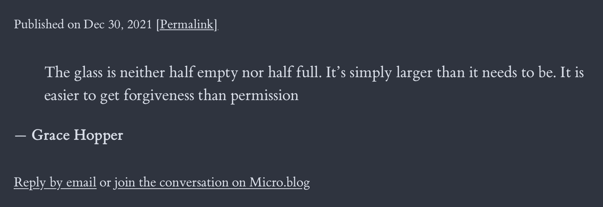

# Tufte specific installation

These instructions are for the Tufte theme to get this specific look:



Of course, you are free to include the link in any way you want. 😊 This is just one way to do it.

## Install the plug-in

1. Find Conversation on Micro.blog in the plug-in directory.
2. Choose the site you want to install the plug-in to.
3. Press *Install*.
4. Congratulations, the plug-in is now installed.

## Include the Conversation on Micro.blog link in the Tufte theme

For this step, you need a custom theme. Maybe you already have one? If not, [follow Manton's instructions here](https://help.micro.blog/t/custom-themes/59).

1. [Follow this link](https://micro.blog/account/themes) or go to *Design* → *Edit Custom Themes*.

2. Click on your custom theme. (It's probably named Tufte Custom or something like that.)

3. Click on the template `layouts/partials/article.html`.

4. Paste the following snippet right before the closing `</div>` for `<div class="email-reply">`.
```
 or {{ partial "conversation-link.html" . }}
```
The relevant part of the template should look like this:
```
  <div class="email-reply">
{{ if .Title }}
    <a class="reply" href="mailto:{{ .Site.Params.mailto }}?subject=Reply%20to%20{{ .Title }}">Reply by email</a>
{{ else }}
<a class="reply" href="mailto:{{ .Site.Params.mailto }}?subject=Reply%20to%20{{ .Permalink | safeURL }}">Reply by email</a>
{{ end }}
 or {{ partial "conversation-link.html" . }}
  </div>
```

5. Press *Update Template* and pat yourself on the back.

## Configure the plug-in

1. Go to *Plug-ins* and press ⚙️ *Settings* (next to the Conversation on Micro.blog plug-in).

2. Enter the following as *Link text*:
```
join the conversation on Micro.blog
```

3. Enter the following as *Fallback link text*:
```
go to my profile on Micro.blog
```

4. Press *Update Settings* and go to the next step.

## Add custom CSS to adjust text size

1. Go to *Design* → *Edit CSS*

2. Paste the following into the text field:
```
.email-reply {
  font-size: 1.2rem;
}
```

3. Press *Update CSS* and go to the next step.

## Make sure the "join the conversation on Micro.blog" link show up

1. Find a post on your blog and make sure you see the *join the conversation on Micro.blog* link.

2. Click it, make sure it takes you to the timeline on Micro.blog.

## Having troubles?

Feel free to [reach out to @sod on Micro.blog](https://micro.blog/sod) for additional help.
